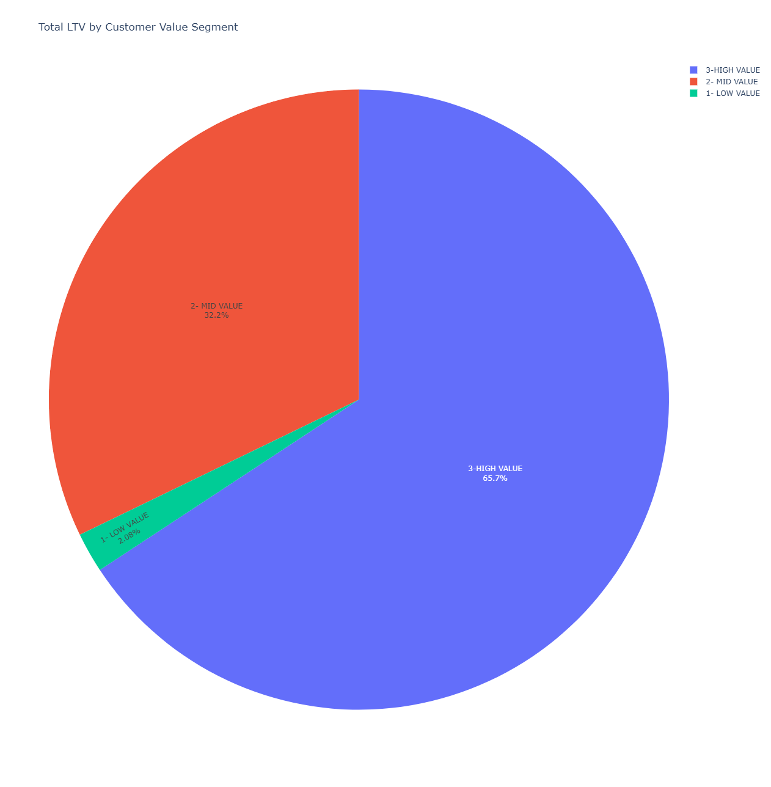

# Intermediate SQL - Sales Analysis

## Overview
Analysis of customer behavior, retention, and lifetime value for an e-commerce company to improve customer retention and maximize revenue.

## Business Questions
-   **Customer Segmentation:** Who are our most valuable customers?
-   **Cohort Analysis:** How do different customer groups generate revenue?
-   **Retention Analysis:** Which customers haven't purchased recently?

## Clean Up Data
🖥️ **Query:** [0_create_view.sql](Scripts/0_create_view.sql) -   Aggregated sales and customer data into revenue metrics.
-   Calculated first purchase dates for cohort analysis.
-   Created a view combining transactions and customer details.

## Analysis

### 1. Customer Segmentation
🖥️ **Query:** [1_customer_segmentation.sql](Scripts/1_customer_segmentation.sql) -   Categorized customers based on total lifetime value (LTV).
-   Assigned customers to High, Mid, and Low-value segments.
-   Calculated key metrics like total revenue and average LTV per segment.

📈 **Visualization:**



The data produced by the `1_customer_segmentation.sql` query (which includes customer count, total LTV, and average LTV for each segment) is used as input for a Python script. This script utilizes the Plotly library to generate an interactive pie chart.

-   **Chart Purpose:** To visually represent the share of total LTV contributed by each customer segment (High, Mid, Low).
-   **Interactivity:** Percentages are displayed directly on the pie slices. Hovering over a segment reveals detailed metrics:
    -   Segment Name
    -   Percentage of Total LTV
    -   Total LTV for the Segment
    -   Customer Count in the Segment
    -   Average LTV per Customer in the Segment
-   **Output & Access:** The visualization is a standalone HTML file, making it easily shareable.
    [View Interactive LTV Segmentation Chart](interactive_ltv_pie_chart.html)
    *(Ensure `interactive_ltv_pie_chart.html` is accessible, e.g., in the same GitHub repository folder or hosted elsewhere).*

📊 **Key Findings:**

-   High-value segment (25% of customers) drives 66% of revenue ($135.4M).
-   Mid-value segment (50% of customers) generates 32% of revenue ($66.6M).
-   Low-value segment (25% of customers) accounts for 2% of revenue ($4.3M).

💡 **Business Insights:**

-   **High-Value (66% revenue):** Offer a premium membership program to 12,372 VIP customers, as losing one customer significantly impacts revenue.
-   **Mid-Value (32% revenue):** Create upgrade paths through personalized promotions, with a potential $66.6M → $135.4M revenue opportunity.
-   **Low-Value (2% revenue):** Design re-engagement campaigns and price-sensitive promotions to increase purchase frequency.

### 2. Customer Revenue by Cohort
🖥️ **Query:** [2_cohort_analysis.sql](link_to_2_cohort_analysis.sql_on_github) The following SQL query analyzes revenue from customers based on their cohort year (the year of their first purchase). It specifically looks at the revenue generated from transactions that occurred on the customer's `first_purchase_date`. This helps understand the initial spending behavior of different cohorts.

```sql
-- File: 2_cohort_analysis.sql
SELECT
    cohort_year,
    ROUND(SUM(total_net_rev)::numeric, 2) AS total_revenue,
    COUNT(DISTINCT customerkey) AS total_customers,
    ROUND(
        SUM(total_net_rev)::numeric / NULLIF(COUNT(DISTINCT customerkey), 0)
    ) AS customer_revenue
FROM cohort_analysis
WHERE orderdate = first_purchase_date
GROUP BY cohort_year;

```    


# Cohort Analysis Report (Initial Purchase Data)

This report analyzes customer cohort data based on their initial purchase year, focusing on total revenue, total customers, and average customer revenue at the time of their first engagement.

##  Cohort Performance Data

| cohort_year | total_revenue | total_customers | customer_revenue |
|-------------|----------------|------------------|------------------|
| 2015        | 7939067.47     | 2825             | 2810.29          |
| 2016        | 10309452.10    | 3397             | 3034.87          |
| 2017        | 12308043.27    | 4068             | 3025.58          |
| 2018        | 20639179.47    | 7446             | 2771.85          |
| 2019        | 22261147.58    | 7755             | 2870.55          |
| 2020        | 6942437.41     | 3031             | 2290.48          |
| 2021        | 12246413.14    | 4663             | 2626.29          |
| 2022        | 20565768.62    | 9010             | 2282.55          |
| 2023        | 12036152.49    | 5890             | 2043.49          |
| 2024        | 2633485.18     | 1402             | 1878.38          |

## 📈 Visualization

A visual representation of this data can be found in the accompanying graph:

*(Note: Ensure the image path is correct relative to your README file's location when you use this.)*

## 📊 Key Findings (Based on Initial Purchase Data)

* **Declining Initial Spend per Customer:** Average initial spend peaked with the 2016 cohort (~$3,035) and 2017 cohort (~$3,026), dropping to ~$1,878 for the 2024 cohort.
* **Peak Performance Mismatch & Downtrend:** Total initial revenue from new cohorts peaked in 2019 (~$22.3M), while new customer acquisition peaked later in 2022 (9,010 customers). Notably, total revenue did not reach its 2019 peak in 2022 due to the lower average revenue per customer. Both total initial revenue and new customer acquisition are trending down in 2024.
* **Acquisition Volatility:** Significant dips in new customer numbers and their initial revenue (e.g., 2020, 2024) indicate inconsistent new customer engagement.

## 💡 Business Insights (Based on Initial Purchase Data)

### 1. Replicate Peak Revenue Strategies (2018-2019)
* **Observation:** 2018 and especially 2019 saw very high total initial revenue from new customers.
* **Action:** Investigate and aim to replicate the marketing campaigns, product focus, and promotional strategies from 2018-2019 that drove this high overall initial revenue.

### 2. Boost Average Initial Spend
* **Observation:** Newer customers spend less on their first purchase than earlier cohorts (e.g., 2016-2017).
* **Action:** Implement strategies to increase first-purchase AOV (Average Order Value), such as compelling introductory offers, product bundles, or optimizing the new user journey to highlight value.

### 3. Align Acquisition with High-Value Initial Purchases
* **Observation:** Peak customer numbers (2022) didn't align with peak initial revenue (2019) or peak average spend (2016-2017).
* **Action:** Refine customer acquisition to target segments more likely to make larger initial purchases, balancing volume with initial transaction quality.

### 4. Stabilize New Customer Engagement
* **Observation:** Volatility in new customer acquisition and their initial spending creates unpredictability.
* **Action:** Diversify acquisition channels and continuously optimize the initial customer experience and offers to ensure a more consistent flow of engaged first-time buyers.


---
# Cohort Analysis Report (Total Lifetime Revenue & ARPC)

This report analyzes customer cohort data based on their entire lifetime, focusing on total lifetime revenue generated by each cohort and the average revenue per customer (ARPC) over their lifetime.

## 📈 Visualization

The visual representation of this data, "Customer Lifetime Revenue and ARPC by Cohort," is provided in the image: 
*(Note: Ensure the image path is correct relative to your README file's location when you use this.)*

## 📊 Cohort Lifetime Performance Data

| Cohort Year | Total Lifetime Revenue | Total Customers | ARPC (Lifetime) |
|-------------|------------------------|-----------------|-----------------|
| 2015        | $15,870,339.42         | 2825            | $5,618          |
| 2016        | $18,770,034.11         | 3397            | $5,525          |
| 2017        | $22,689,803.59         | 4068            | $5,578          |
| 2018        | $37,093,401.68         | 7446            | $4,982          |
| 2019        | $36,564,591.53         | 7755            | $4,715          |
| 2020        | $11,763,692.40         | 3031            | $3,881          |
| 2021        | $18,429,387.49         | 4663            | $3,952          |
| 2022        | $28,419,482.53         | 9010            | $3,154          |
| 2023        | $13,951,293.63         | 5890            | $2,369          |
| 2024        | $2,721,120.06          | 1402            | $1,941          |

*Note: ARPC for recent cohorts, especially 2024, will continue to evolve as more time passes.*

## 🔑 Key Findings

* **Peak Performance:** The **2018 cohort** achieved the highest Total Lifetime Revenue ($37.1M). Earlier cohorts (**2015-2017**) show the highest ARPC (Lifetime), peaking at $5,618 (2015).
* **Significant Recent Contribution (2022):** The **2022 cohort**, despite having less time, has generated substantial Total Lifetime Revenue ($28.4M) due to a large customer base (9,010). Its ARPC ($3,154) is lower than peak ARPC cohorts but represents a significant overall revenue contribution in a shorter period.
* **ARPC Trend:** A general downward trend in ARPC (Lifetime) is noticeable for more recent cohorts.
* **Early Status of New Cohorts:** The 2023 and 2024 cohorts are still in their early stages, with ARPC figures expected to mature over time.

## 💡 Brief Business Insights

* **Analyze Top Cohorts:** Investigate factors driving success in high Total Revenue cohorts (e.g., 2018, 2019) and high ARPC cohorts (2015-2017) to replicate positive trends.
* **Maximize Value from Large Cohorts:** For high-volume cohorts like 2022, focus on increasing average customer spend over their remaining lifetime (e.g., through targeted offers, loyalty initiatives) to build upon their already significant revenue base.
* **Address ARPC Evolution:** Develop strategies to enhance long-term customer value and retention, particularly for newer cohorts, to positively influence the ARPC trajectory.
* **Nurture New Customers:** For the newest cohorts (2023, 2024), prioritize strong initial engagement and value delivery to foster loyalty and future spending.

---

# 3. Customer Retention Analysis
🖥️ **Query:** [3_retention_analysis.sql](link_to_3_retention_analysis.sql_on_github) - This query identifies active vs. churned customers based on a 6-month inactivity window. It only considers customers whose first purchase was at least 6 months prior to the latest transaction date in the dataset, providing a fair assessment of churn.

## 📈 Visualization
The visual representation of this data, Total Customer Retention (Status) and Churn by Cohort Year," is provided in the image as a precentage and a count: 

--
# 💡 Key Retention Insights (Based on 6-Month Inactivity Churn Definition)

## 📊 Key Retention Findings

- Churn stabilizes at ~91–92% after 2–3 years, revealing a predictable long-term pattern across mature cohorts.
- Retention rates are low (8–10%) and consistent, indicating systemic retention challenges.
- Newer cohorts (2022–2023) show only slight improvement—without intervention, future cohorts may follow the same trend.

## 💡 Business Opportunities

- **Boost Early Lifecycle Engagement:** Prioritize onboarding, loyalty rewards, and time-sensitive offers to drive second and third purchases within the first 3–6 months.
- **Reclaim High-Value Churned Users:** Focus retention spend on targeted win-back campaigns with proven buyers for better ROI than broad efforts.
- **Redefine & Predict Churn:** Reevaluate if the 6-month inactivity window aligns with repurchase cycles. Build early warning systems to trigger preemptive retention actions.
# 🧠 Strategic Recommendations

## Customer Value Optimization (Customer Segmentation)

- Launch a VIP loyalty program for 12,372 high-value customers (responsible for 66% of total revenue).
- Build personalized upgrade journeys for mid-tier customers ($66.6M → $135.4M opportunity) to increase AOV and LTV.
- Introduce dynamic pricing and promotional strategies for price-sensitive low-value customers to drive frequency without margin erosion.
- Leverage behavioral insights from the 8–10% consistently active segment to identify and nurture future high-potential customers.

## Cohort Performance Strategy (Customer Revenue by Cohort)

- Double down on 2022–2024 cohorts: though early, they show strong revenue contribution potential (e.g. 2022 cohort: $28.4M from 9,010 customers).
- Replicate successful tactics used in peak ARPC cohorts (2015–2017) and revenue cohorts (2018–2019) to drive value in newer cohorts.
- Monitor ARPC (Lifetime) trends and design mid-funnel campaigns to increase customer stickiness and expand cohort value over time.
- Balance acquisition and retention investments by tracking CAC vs. LTV by cohort.

## Retention & Churn Prevention (Customer Lifecycle Management)

- Focus on onboarding and nurturing within the first 1–2 years of customer activity — the most critical window before churn stabilizes.
- Deploy targeted win-back campaigns for high-value churned users, which may deliver higher ROI than broad-based retention efforts.
- Evaluate whether the current 6-month churn threshold aligns with actual buying cycles across product categories and segments.
- Implement churn prediction models using transactional and engagement data to trigger pre-emptive outreach or incentives.

## Revenue Growth Acceleration (Cross-Functional Strategy)

- Identify cross-sell/upsell paths from the behaviors of high-ARPC users and embed those into CRM workflows for mid- and low-tier segments.
- Explore subscription models or bundling tactics to create recurring value streams and reduce revenue volatility.
- Test segmented email/SMS campaigns tied to cohort and segment performance trends to lift engagement across lifecycle stages.
- Allocate more marketing budget toward scalable re-engagement strategies for the largest-volume cohorts (e.g. 2022).

---

# 🛠 Technical Details

- **Database:** PostgreSQL  
- **Analysis Tools:** PostgreSQL, DBeaver  
- **Visualization:** ChatGPT


# BONUS VIZ: Global Revenue Trends & Growth (Country-Level Analysis)

Query : [4_cagr_country_revenue.sql](link_to_3_retention_analysis.sql_on_github)
This analysis examines revenue performance across key international markets from 2015 to 2023, highlighting growth leaders and strategic opportunities.

## 📈 Visualizations

*   Line Chart: Revenue Growth by Country (2015-2023)

*   Stacked Bar Chart: Total Revenue by Year & Country Contribution (2015-2023)

*   Pie Charts:
    *   Average Annual Revenue Contribution by Country (2015-2023) -hyperlink
    *   Revenue Contribution by Country - 2015 - hyperlink
    *   Revenue Contribution by Country - 2023 - will hyperlink


## 📊 Key Findings

1.  **US Dominance & Consistent Growth:** The US remains the primary revenue driver, showing sustained and significant growth. Other key markets like Canada (CA), Germany (DE), and Australia (AU) also exhibit strong, consistent expansion.
2.  **Netherlands (NL) - Exceptional Growth Rate:** NL demonstrates the highest Compound Annual Growth Rate (CAGR) from 2015-2023, indicating rapid market penetration and success, albeit from a smaller initial base. Pie charts for 2015 vs. 2023 visually confirm NL's increasing share.

## 💡 Brief Business Insights

*   **Replicate High-Growth Models:** Investigate and potentially replicate successful strategies from high-CAGR markets like NL and strong performers (US, CA, DE, AU) to other regions or to further accelerate growth in these key areas.
*   **Strategic Focus for NL:** Given NL's exceptional CAGR, conduct a deeper analysis to understand the drivers (e.g., specific campaigns, market conditions, product fit). Determine if this success is scalable or offers lessons for other smaller/emerging European markets.
